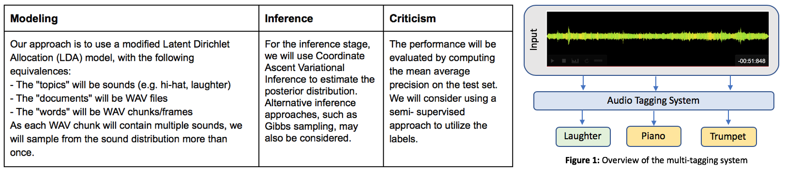
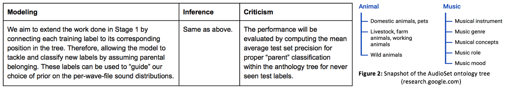

# Audio Tagging System with Probabilistic Programming
## Project Overview

### Description
**Goal:** Develop an automatic, general-purpose audio tagging system capable of accurately classifying sound collections for a wide range of real-world environments.

**Data:** The original dataset is taken from Kaggle [1]. The samples (20,000 WAV files) are generated from Freesound's library and include things like musical instruments, domestic sounds, and animals [2]. Each input represents a WAV file with a corresponding annotative label. There are 41 labels overall, each generated from Google’s AudioSet ontology. The dataset also includes a boolean column indicating whether the label was manually verified.

### Proposal
To achieve the goal, we will be cycling through Box’s loop [3]. Due to the complexity of the task, we propose two separate stages to address both the model performance (given a fixed number of labels) as well as generalizing to the complexity of real-world data (e.g. classifying sounds that were not in the training set).

**Stage 1:** This stage will focus on tuning the model for the highest possible performance given a fixed number of labels. The test will be performed on a subset of the data with only training labels in place.

Having achieved a high performing model during stage 1, it would still not be representative of the real world (expected poor performance on sounds outside of the original labeling).

**Stage 2:** This stage will focus on using Google’s AudioSet ontology tree to improve the model performance on new sounds (i.e. sounds whose labels were not part of original learning)

## References

1. Eduardo Fonseca, Manoj Plakal, Frederic Font, Daniel P. W. Ellis, Xavier Favory, Jordi Pons, Xavier Serra. General-purpose Tagging of Freesound Audio with AudioSet Labels: Task Description, Dataset, and Baseline. Submitted to DCASE2018 Workshop, 2018. URL:https://arxiv.org/abs/1807.09902
2. Eduardo Fonseca, Jordi Pons, Xavier Favory, Frederic Font, Dmitry Bogdanov, Andrés Ferraro, Sergio Oramas, Alastair Porter, and Xavier Serra. Freesound datasets: a platform for the creation of open audio datasets. In Proceedings of the 18th International Society for Music Information Retrieval Conference (ISMIR 2017), pp 486-493. Suzhou, China, 2017.
3. Box, G. E. (1976). Science and statistics. Journal of the American Statistical Association, 71(356):791–799.
